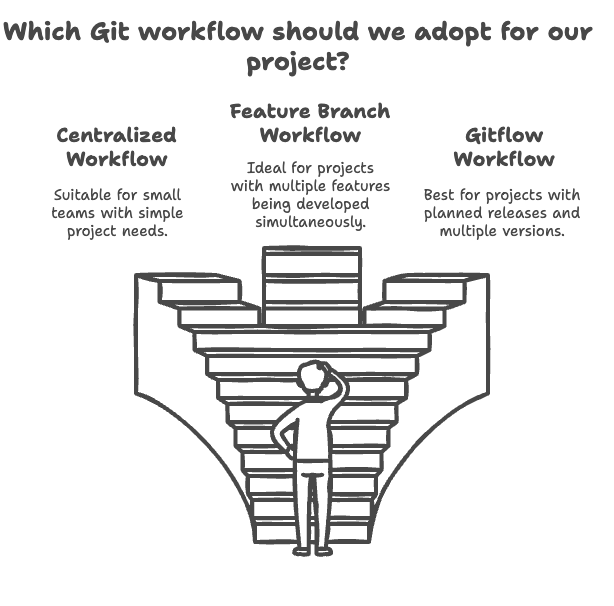

# Git Workflows

  

Git offers great flexibility for managing projects, especially in teams. Below, we present some of the main workflows that help organize, collaborate, and maintain code quality.

Here's the updated Table of Contents based on your content:

# Table of Contents

1. [Centralized Workflow](#centralized-workflow)
2. [Feature Branch Workflow](#feature-branch-workflow)
3. [Gitflow Workflow](#gitflow-workflow)
4. [Forking Workflow](#forking-workflow)
5. [Trunk-Based Development Workflow](#trunk-based-development-workflow)
6. [How to Choose the Best Workflow?](#how-to-choose-the-best-workflow)
7. [Common Terms](#common-terms)
8. [About the Author](#about-the-author)
9. [License](#license)

Feel free to modify any sections or add additional topics as needed!
## **Centralized Workflow**

This is the simplest model, where all developers work on a single branch, usually `main` or `master`. The basic steps are:

- Clone the repository
- Make changes locally
- Commit and push directly to the main branch

Ideal for: Small teams or personal projects. It's easy to manage but less suitable for large teams due to the risk of frequent conflicts.

## **Feature Branch Workflow**

In this model, each new feature or bug fix is developed in a separate branch, known as a “feature branch.” The sequence is:

- Create a new branch for the feature or bug fix (`git checkout -b feature-name`)
- Work on the branch and commit regularly
- When the feature is ready, merge it into the main branch (or submit it as a Pull Request)

Advantages:
- Keeps the main branch stable
- Allows parallel work on multiple features

Ideal for: Medium to large teams, where each member can work on different features without interrupting others' work.

## **Gitflow Workflow**

**Gitflow** is a more comprehensive and structured workflow model, ideal for large projects with defined release cycles. It uses different branches to manage features, releases, and fixes:

- `main`: Contains the code of the latest released version
- `develop`: Development branch where new features are integrated
- **Feature branches**: Created from `develop` to work on new features
- **Release branches**: Created from `develop` to prepare for a new release
- **Hotfix branches**: Created from `main` to fix critical bugs in the production version

This model allows for a well-organized workflow, ideal for projects requiring stability and a defined release process.

## **Forking Workflow**

Widely used in open-source projects, the Forking Workflow allows contributors to work on a copy of the original repository:

- **Fork** the repository to create a copy in your account
- Work on changes in your own copy
- Submit changes to the original repository via a Pull Request

This model promotes collaboration without affecting the main repository and facilitates code review before any merge.

Ideal for: Open-source projects and external contributions.

## **Trunk-Based Development Workflow**

In Trunk-Based Development, developers make frequent commits directly to a central branch, typically `main`, and integrate small changes as quickly as possible. This approach emphasizes:

- Frequent commits and quick integrations
- Minimizing long-lived branches
- Fast and constant code reviews

It is a workflow that favors agile teams and continuous delivery (CI/CD) environments.

Ideal for: Teams following DevOps practices who need high delivery speed.

### How to Choose the Best Workflow?

Choosing a workflow depends on factors such as team size, project complexity, and release frequency. Experiment with different approaches to find the one that best suits your needs. Practicing and adapting workflows will help your team gain efficiency and maintain a clean and organized code history.

## Common Terms

- **`fork`**: A copy of a repository to your own GitHub account, creating a new repository in your account that is independent of the original. This allows you to make changes without affecting the original repository.

- **`issues`**: A tool used to manage tasks, feature requests, and bug fixes in open-source projects, allowing collaborators to discuss and track progress.

- **`pull request`**: A mechanism to submit proposed changes to the original repository. A pull request is a request for project maintainers to review and potentially merge the changes. It goes through a review process and may be accepted or rejected.

## About the Author

This repository was created and is maintained by **Ciro Cesar Maciel**. I am a Software Engineer passionate about creating efficient and well-documented solutions. I am always looking for new tools and practices that can simplify and improve the development workflow.

In addition to this project, I have been working on other interesting projects related to automation, Artificial Intelligence (AI), browser extensions, and more. I am also beginning to teach what is necessary to learn Artificial Intelligence (AI), helping others to get started on their AI journey.

If you are interested in Software Development, Data Science, AI, or other tech topics, feel free to explore my GitHub profile and connect with me.

### How to Find Me:

- GitHub: [ciro-maciel](https://github.com/ciro-maciel)
- LinkedIn: [Ciro Cesar Maciel](https://www.linkedin.com/in/ciro-maciel/)
- Website: [ciro-maciel](https://www.ciro-maciel.click)

I am always open to new collaborations and projects. If you have an interesting idea or just want to exchange thoughts about development, don't hesitate to reach out!

## License

This project is licensed under the MIT License - see the [LICENSE](LICENSE) file for details.
